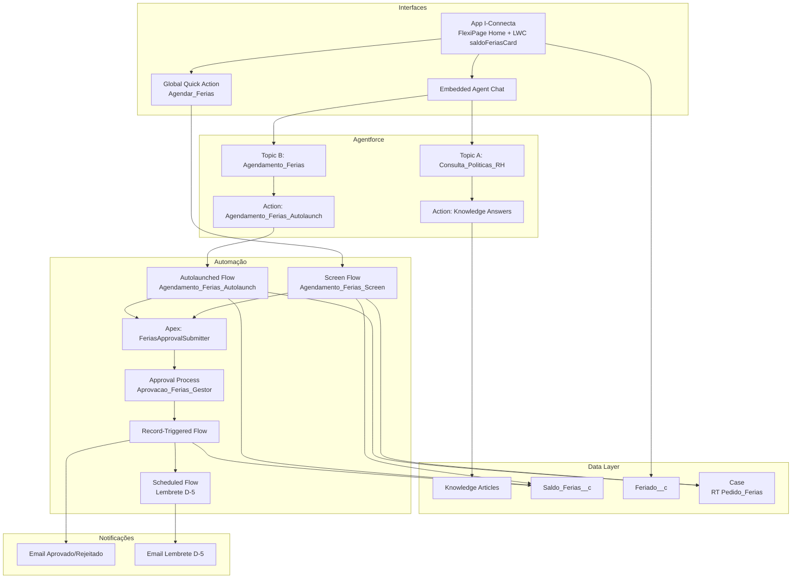

# Arquitetura — Demo Agentforce RH Itaú

## Visão geral

A demo demonstra dois padrões complementares do Agentforce numa única experiência:

1. **Agente informativo (linguagem natural)** — reduz carga do RH respondendo dúvidas recorrentes sobre políticas, usando Knowledge Base como fonte da verdade.
2. **Agente transacional — caminho duplo (Escopo D, Híbrido):**
   - **Pelo chat do Agent:** invoca o **Autolaunched Flow** `Agendamento_Ferias_Autolaunch`, que recebe datas/abono como parâmetros, valida as regras CLT, cria o Case e devolve `varSucesso` + `varMensagemErro` + `varCaseNumber` para o agent compor a resposta em linguagem natural.
   - **Pela UI (app I-Connecta):** o mesmo conjunto de regras está no **Screen Flow** `Agendamento_Ferias_Screen`, acessível como **Global Quick Action** (`Agendar_Ferias`) e pelo botão "Agendar" do LWC `saldoFeriasCard` na Home do app. Esse caminho oferece formulário guiado com progresso visual para quem prefere UI estruturada.

Os dois caminhos compartilham o mesmo `FeriasApprovalSubmitter` (Apex Invocable) e o mesmo `Approval Process`. Validação CLT, criação do Case e submissão à aprovação são idênticas — apenas o _frontend_ muda.

## Diagrama de componentes

## Decisões de design

### Por que híbrido (Autolaunched Flow + Screen Flow) e não só NL?
Contexto bancário exige determinismo. O **Autolaunched Flow** invocado pelo agent permite que a conversa colete datas em linguagem natural, mas a validação das regras CLT e a criação do Case são executadas em Flow determinístico (não pelo LLM). Já o **Screen Flow** é mantido para o caminho UI (Quick Action + LWC), onde colaboradores mais formais preferem date pickers e feedback visual imediato. Ambos compartilham a mesma lógica de negócio, garantindo consistência.

### Por que não apenas o Screen Flow invocado pelo agent?
Screen Flows não são invocáveis diretamente como Actions do Agentforce — somente Autolaunched Flows e Apex Invocables aparecem no seletor de Actions. Por isso separamos: Screen Flow para UI direta, Autolaunched Flow (com os mesmos decisions + assignments + create record) para o agent.

### Por que Case em vez de objeto custom para o pedido?
- Case já tem Approval Process, histórico, SLA, ownership nativo
- Aproveitamento de toda a infra de Service Cloud (fila do RH, macros, quick actions)
- O RH pode usar as mesmas ferramentas que usa para outros pedidos internos

### Por que formula no `Dias_Direito__c`?
A escala do art. 130 CLT depende das faltas injustificadas. Implementar como formula garante que qualquer ajuste de faltas recalcula o direito automaticamente, sem precisar de trigger.

### Por que Roll-Up vs Number manual em `Dias_Tirados__c`?
Para a demo usaremos Number manual atualizado pelo Record-Triggered Flow (mais controlável na apresentação). Em produção, considerar Roll-Up Summary sobre Cases aprovados.

## Breakdown de esforço

| Componente | Horas |
|---|---|
| Setup org + 3 Users + role hierarchy + permission sets | 2 |
| Objeto `Saldo_Ferias__c` (campos, formulas, validation, layout) | 3 |
| Case: RecordType + custom fields + layouts | 2 |
| Approval Process com aprovador dinâmico | 2 |
| 5 Knowledge Articles (escrita + publicação + data categories) | 4 |
| Screen Flow `Agendamento_Ferias_Screen` | 8 |
| Autolaunched Flow `Agendamento_Ferias_Autolaunch` (mesma lógica CLT) | 3 |
| Record-Triggered Flow + Scheduled Flow D-5 | 3 |
| 3 Email Templates Lightning | 1 |
| Agentforce: agent + 2 Topics + scope + instructions | 3 |
| Custom App I-Connecta + FlexiPage Home + Tabs + Quick Action | 3 |
| LWC `saldoFeriasCard` + Apex controller | 3 |
| `Feriado__c` + seed 2026 | 1 |
| Messaging Channel + EmbeddedServiceConfig | 2 |
| Dados de teste | 1 |
| Testes E2E (3 jornadas) | 3 |
| Roteiro + slides de apoio | 3 |
| **Subtotal** | **46** |
| Margem de risco (tuning Agentforce) +20% | 9 |
| **Total realista** | **~55** |

## Riscos e mitigações

| Risco | Mitigação |
|---|---|
| Classificação do Topic não dispara Action transacional | Testar com 20+ variações de frases ("quero marcar", "preciso agendar", "tirar férias", etc) |
| Scheduled Flow não executa em Developer org por limites de tempo | Documentar via tela de admin que a execução é garantida; em demo ao vivo, usar data próxima |
| LLM alucinar políticas fora da KB | Instructions explícitas + fallback `Criar_Caso_Duvida_RH` |
| Aprovador dinâmico falha se colaborador não tem Manager | Validação no Flow antes de submeter + fallback para fila `RH_Ferias` |
| Agent não coletar datas em formato correto (DD/MM) | Autolaunched Flow recebe `Date` tipado; se LLM passar string, a instrução do Topic obriga normalização antes de invocar |
| Divergência de regra CLT entre Screen Flow e Autolaunched Flow | Ambos compartilham o mesmo Approval Process + `FeriasApprovalSubmitter`; regras CLT devem ser revisadas em par nos dois flows a cada mudança |
