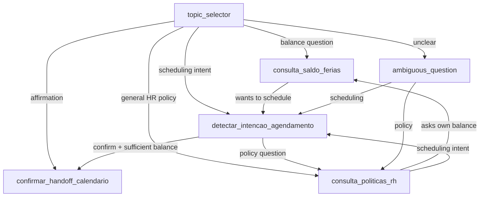

# Agent Spec: Agent_Itau_RH_Handoff_Calendario

## Purpose & Scope

Employee Agent isolated for the Screen Flow POC v2 (agent-driven handoff). It answers HR policy questions, can answer direct questions about the employee's vacation balance, and after explicit confirmation by the employee (and only if balance rules allow) fires a Platform Event that releases the calendar inside the Screen Flow. The agent itself never collects dates and never opens vacation requests.

Out of scope:

- Creating vacation Cases.
- Invoking `Agendamento_Ferias_Autolaunch`.
- Collecting scheduling dates in chat.
- Approving or submitting vacation requests.

## Configuration

- Agent type: `AgentforceEmployeeAgent`
- Default agent user: N/A. The Employee Agent uses the authenticated employee context.
- Flow access: granted through `flowAccesses` for `Agendamento_Ferias_Handoff_Screen`.
- Class access: granted through `classAccesses` for `IniciarHandoffAgendamento`, `ConsultarSaldoFerias`, and `ConsultarPoliticasRH`.
- Object access: `Handoff_Calendario_RH__e` Platform Event must be readable for `subscribe` (LWC) and creatable for `publish` (Apex). The permission set grants both.
- `Saldo_Ferias__c` read + FLS on non-required fields used by `ConsultarSaldoFerias` (e.g. `Dias_*`, `Periodo_Concessivo_Fim__c`). Required picklists such as `Status__c` and `Regime_Contratacao__c` cannot be added as `fieldPermissions` rows in some orgs (deploy error: required field); they remain readable via object-level read where applicable.
- Agent access: `agentAccesses` for `Agent_Itau_RH_Handoff_Calendario` is included in the POC permission sets only after the agent is published/activated and the generated Bot metadata exists in the org. Salesforce rejects this access before the Bot exists.

## Topic Map

## Actions & Backing Logic

| Action | Target | Purpose | Status |
|---|---|---|---|
| `consultar_politicas` | `apex://ConsultarPoliticasRH` | Search published Knowledge articles for HR policy answers. | Reused |
| `consultar_saldo_ferias` | `apex://ConsultarSaldoFerias` | Read current user's `Saldo_Ferias__c` with `Status__c = Vigente`. Returns `temSaldoSuficiente` (>= 5 dias disponiveis), numeric breakdown, and a PT-BR `message` for the agent to relay. | New |
| `iniciar_handoff_agendamento` | `apex://IniciarHandoffAgendamento` | Publish `Handoff_Calendario_RH__e` Platform Event so the LWC reveals the calendar. | Existing |

### Balance gate (Option B)

- `detectar_intencao_agendamento` calls `consultar_saldo_ferias` on the first turn. If `temSaldoSuficiente` is false, the agent must relay the Apex `message`, must not ask for calendar confirmation, and must not route to `confirmar_handoff_calendario` (even if the user says "sim").
- `confirmar_handoff_calendario` re-calls `consultar_saldo_ferias` before `iniciar_handoff_agendamento` (defense in depth). If balance is insufficient, do not publish the Platform Event.
- `consulta_saldo_ferias` answers balance-only questions; it never calls `iniciar_handoff_agendamento`. It may offer to schedule only when `temSaldoSuficiente` is true.

### Optional inputs pattern (lesson learned)

The action `iniciar_handoff_agendamento` accepts `mensagem` and `sessionId` as optional inputs (Apex falls back to defaults). Three points must align to compile AND load at runtime, otherwise the agent runtime returns `412 Precondition Failed: Unable to load agent config: Invalid Config` on the `/agents/{id}/sessions` endpoint:

1. The Apex `@InvocableVariable` must declare `required=false` explicitly. Implicit defaults are not enough for the Agent Script compiler.
2. The `.agent` action MUST declare an `inputs:` block listing every input. Omitting `inputs:` makes the compile pass but the published agent fails to load its runtime config.
3. The reasoning call site MUST pass every declared input via `with`, on a single line, even when delegating to the LLM. Use `with mensagem = ..., sessionId = ...` to let the LLM decide whether to fill them; the Apex defaults handle empty values.

`consultar_saldo_ferias` uses a dummy optional `token` input (`is_user_input: False`) so the agent can call it with `with token = ...` on one line without user-provided parameters.

If the runtime returns 412 with `Invalid Config`, re-publish the bundle without `--skip-retrieve` and re-activate the new BotVersion to refresh the runtime config.

## Behavioral Intent

- For policy questions, search Knowledge first and answer only from results.
- For direct balance questions ("quantos dias tenho?"), route to `consulta_saldo_ferias`, call the Apex action, and relay `message`.
- For a clear scheduling intent, first validate balance; only if `temSaldoSuficiente` is true, ask for explicit confirmation ("posso liberar o calendario? responda sim ou nao"). Do not call `iniciar_handoff_agendamento` in that topic.
- For an explicit confirmation (sim/confirmo/pode liberar/ok pode abrir), `confirmar_handoff_calendario` re-validates balance, then calls `liberar_calendario` at most once and describes the next step (select start and return dates in the calendar).
- Never claim a vacation request was opened from the chat.
- Never call `liberar_calendario` more than once per confirmation.
- Never collect dates in chat.

## Gating Logic

- `detectar_intencao_agendamento` asks for confirmation only when balance is sufficient; it runs `consultar_saldo_ferias` but cannot run `iniciar_handoff_agendamento`.
- `confirmar_handoff_calendario` is the only topic that can call `iniciar_handoff_agendamento`. The router routes here when the current user message is an affirmation, but the topic itself blocks if balance is insufficient.
- `consulta_saldo_ferias` is read-only for balance display.

## Acceptance Scenarios

- "Posso vender 10 dias de abono?" routes to policy search and answers from Knowledge. No handoff is published.
- "Quanto saldo de ferias eu tenho?" routes to `consulta_saldo_ferias`, Apex returns `message`, agent relays it. No handoff unless user then asks to schedule with sufficient balance.
- "Quero agendar férias" with insufficient balance (`temSaldoSuficiente` false): agent relays blocking `message`, does not ask for confirmation to open the calendar, does not publish the event.
- "Quero agendar férias" with sufficient balance: agent asks for confirmation. No handoff yet.
- After "sim" / "confirmo" with sufficient balance, `confirmar_handoff_calendario` re-checks balance, calls `liberar_calendario`. Platform Event published. Agent answers describing the next step.
- "Quero agendar minhas férias, sim pode liberar" with insufficient balance: agent must not publish handoff even with inline confirmation.
- "Oi" routes to `ambiguous_question`.
- After successful handoff, follow-up policy questions still work in `consulta_politicas_rh` without disturbing the calendar already shown.
