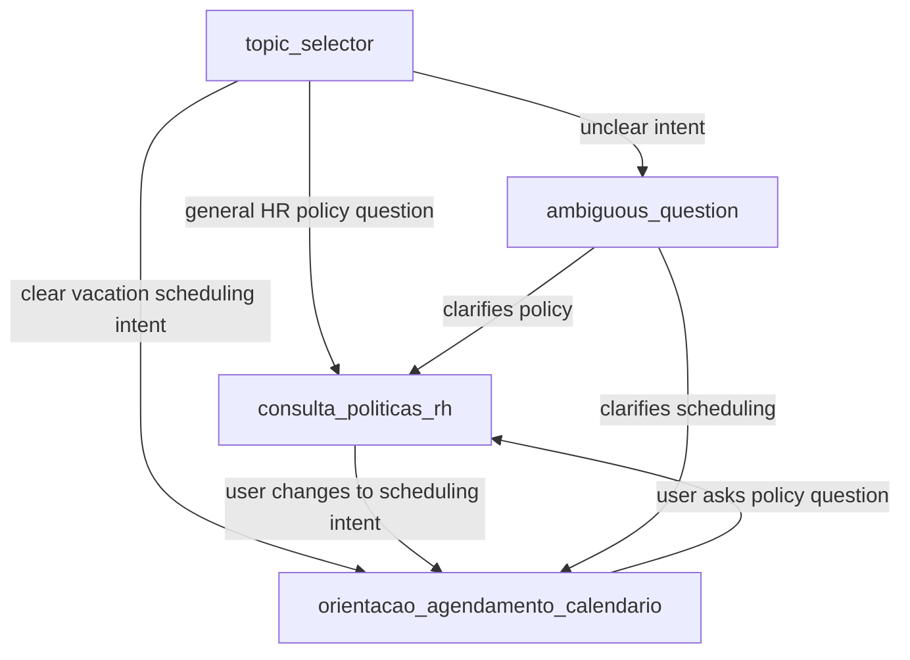

# Agent Spec: Agent_Itau_RH_Handoff_POC

## Purpose & Scope

Employee Agent isolated for the Screen Flow POC. It answers HR policy questions and verbally guides the employee to use the Flow calendar for vacation scheduling.

Out of scope:

- Creating vacation Cases.
- Invoking `Agendamento_Ferias_Autolaunch`.
- Collecting scheduling dates in chat.
- Approving or submitting vacation requests.

## Configuration

- Agent type: `AgentforceEmployeeAgent`
- Default agent user: N/A, employee agent uses the authenticated employee context.
- Flow access: granted through `flowAccesses` for `Agendamento_Ferias_Screen_POC`.
- Agent access: `agentAccesses` for `Agent_Itau_RH_Handoff_POC` is included in the POC permission sets after the agent is published/activated and the generated Bot metadata exists in the org. Salesforce rejects this access before the Bot exists.

## Topic Map

## Actions & Backing Logic

| Action | Target | Purpose | Status |
|---|---|---|---|
| `consultar_politicas` | `apex://ConsultarPoliticasRH` | Search published Knowledge articles for HR policy answers. | Exists |

No scheduling action is defined. This is intentional: the Screen Flow owns date selection, CLT validation, Case creation, and approval submission.

## Behavioral Intent

- For policy questions, search Knowledge before answering.
- For clear scheduling intent, tell the employee to mark `Quero agendar férias agora` and select dates in the calendar below the chat.
- For ambiguous messages, ask whether the employee wants a policy answer or wants to schedule vacation through the calendar.
- Never state that a vacation request was created from the chat.

## Gating Logic

No state variables are required. Topic routing is based on utterance intent only.

## Acceptance Scenarios

- “Posso vender 10 dias de abono?” routes to policy search and answers from Knowledge.
- “Quero agendar férias” routes to calendar guidance and does not call any Flow action.
- “Quero tirar férias de 15/06 a 30/06” routes to calendar guidance and tells the user to use the calendar instead of collecting dates.
- “Oi” asks for clarification.
